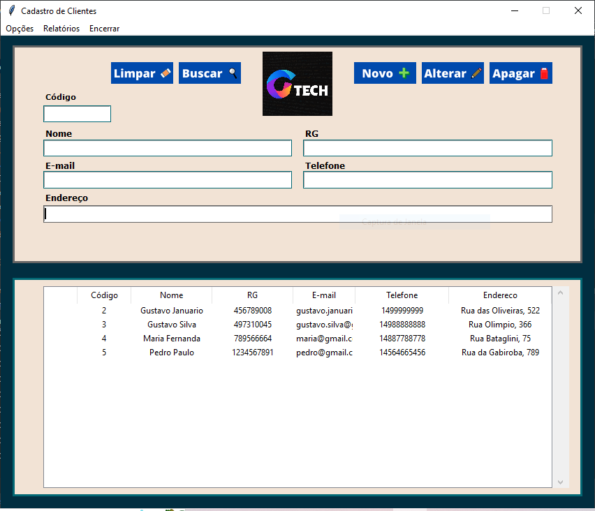

# Tela de cadastro de clientes

Tela desenvolvida no curso técnico de desenvolvimento de software para cadastro de clientes.

## 🛠️ Construído com

* [Pycharm](https://www.jetbrains.com/pt-br/pycharm/) - A IDE utilizada
* [Python](https://www.python.org/) - Linguagem de programação
* [Sqlite3](https://docs.python.org/3/library/sqlite3.html) - Banco de dados

## ✒️ Funcionalidades do projeto

